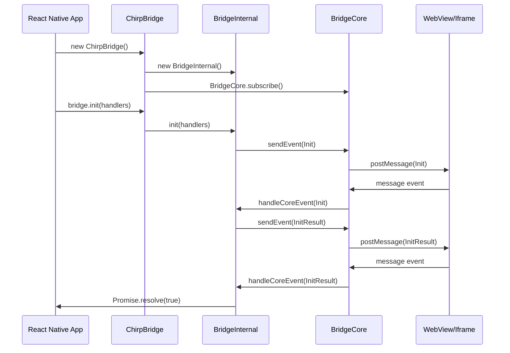
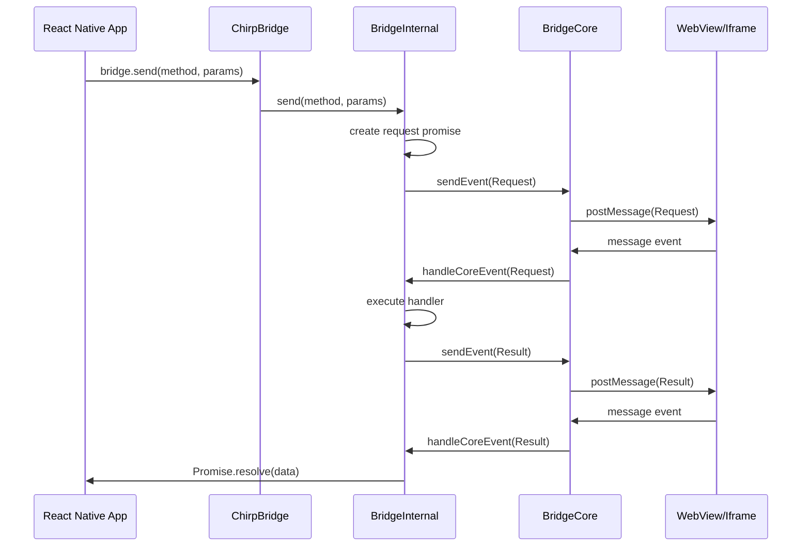
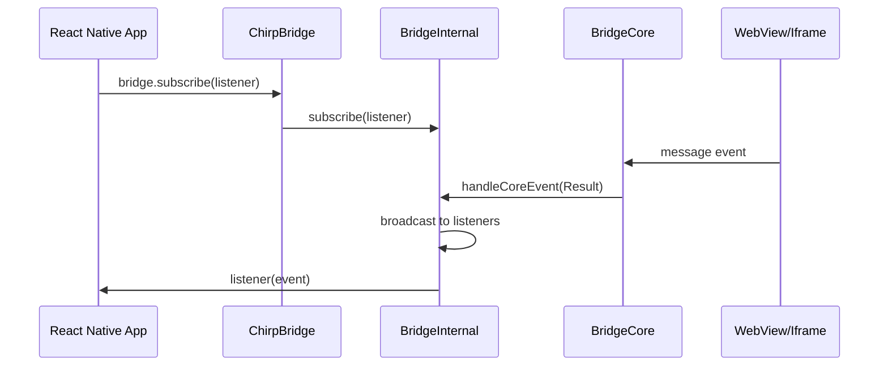

# Architecture

This document explains the internal architecture of the Chirp framework, including how components interact, message flow, and design decisions.

## Table of Contents

- [Overview](#overview)
- [Component Architecture](#component-architecture)
- [Message Flow](#message-flow)
- [Platform Detection](#platform-detection)
- [Error Handling Architecture](#error-handling-architecture)
- [Performance Considerations](#performance-considerations)
- [Security Considerations](#security-considerations)

## Overview

Chirp uses a layered architecture that separates concerns and provides a clean abstraction for cross-platform communication. The framework is designed to be:

- **Modular**: Each component has a single responsibility
- **Extensible**: Easy to add new communication methods
- **Type-safe**: Full TypeScript support with comprehensive types
- **Error-resilient**: Robust error handling at every layer
- **Performance-optimized**: Minimal overhead and efficient message handling

## Component Architecture

### Layer 1: BridgeCore

The lowest level component that handles platform-specific communication.

```tsx
export class BridgeCore {
  // Message serialization and deserialization
  static wrapBridgeEvent(event: Event): string
  static wrapListener(listener: BridgeCoreListener)
  
  // Platform-specific listeners
  static browserListener(listener: BridgeCoreListener)
  static webViewListener(listener: BridgeCoreListener)
  
  // Message sending
  static sendEvent(event: Event): void
  static subscribe(listener: BridgeCoreListener): VoidFunction
}
```

**Responsibilities:**
- Message serialization/deserialization
- Platform detection and appropriate method selection
- Event listener setup and cleanup
- Cross-platform message sending

**Key Features:**
- Automatic platform detection (WebView vs iframe vs browser)
- JSON message wrapping with type safety
- Quote handling for iOS WebView compatibility
- Event listener management

### Layer 2: BridgeInternal

The core business logic layer that manages the communication protocol.

```tsx
export class BridgeInternal {
  // Request/response management
  private requests: InternalRequestPromise[]
  
  // Handler registration
  private handlers: BridgeHandlers
  
  // State management
  private available: boolean
  private supportedMethods: string[]
  
  // Event system
  private listeners: BridgeListener[]
  
  // Public API
  public init(handlers: BridgeHandlers): Promise<boolean>
  public send(method: string, params: object): Promise<any>
  public subscribe(listener: BridgeListener): number
  public unsubscribe(listener: BridgeListener): void
  public handleCoreEvent(event: BridgeEvent): void
}
```

**Responsibilities:**
- Request/response lifecycle management
- Handler registration and execution
- Method availability tracking
- Event routing and broadcasting
- Error handling and timeout management

**Key Features:**
- Promise-based request/response pattern
- Automatic timeout handling (100 seconds)
- Method availability synchronization
- Event subscription system
- Comprehensive error types

### Layer 3: BridgeBase

The public API layer that provides a clean interface for consumers.

```tsx
export class BridgeBase {
  private bridge: BridgeInternal
  
  // Public API methods
  public supports(method: string): boolean
  public isAvailable(): boolean
  public send(method: string, params: object): Promise<any>
  public subscribe(listener: BridgeListener): number
  public unsubscribe(listener: BridgeListener): void
  public init(handlers?: BridgeHandlers): Promise<boolean>
}
```

**Responsibilities:**
- Public API definition
- Interface consistency
- Method delegation to internal implementation

### Layer 4: ChirpBridge

The main entry point that combines all components.

```tsx
export class ChirpBridge extends BridgeBase {
  constructor() {
    const bridge = new BridgeInternal(BridgeCore.sendEvent);
    super(bridge);
    BridgeCore.subscribe(bridge.handleCoreEvent);
  }
}
```

**Responsibilities:**
- Component composition
- Initialization and setup
- Global bridge instance management

## Message Flow

### 1. Initialization Flow



### 2. Request-Response Flow



### 3. Event Broadcasting Flow



## Platform Detection

The framework automatically detects the environment and uses the appropriate communication method:

### Detection Logic

```tsx
static sendEvent = (event: Event): void => {
  const bridgeEvent = BridgeCore.wrapBridgeEvent(event);
  
  if (typeof window === 'undefined') {
    console.warn('Window is undefined');
    return;
  }
  
  const RNW = window?.ReactNativeWebView;
  if (typeof RNW?.postMessage === 'function') {
    // React Native WebView environment
    return RNW.postMessage(`'${bridgeEvent}'`);
  }
  
  if (window.parent === window) {
    // Top-level window (no parent)
    return;
  }
  
  // Iframe environment
  return window.parent.postMessage(bridgeEvent, '*');
};
```

### Platform-Specific Features

#### React Native WebView
- Uses `ReactNativeWebView.postMessage()`
- Wraps messages in quotes for iOS compatibility
- Handles `nativeEvent.data` structure

#### Web Iframe
- Uses `window.parent.postMessage()`
- Direct JSON message passing
- Handles `MessageEvent.data` structure

#### Browser Environment
- Uses `window.addEventListener('message')`
- Supports both iframe and WebView scenarios
- Automatic event listener management

## Error Handling Architecture

### Error Types Hierarchy

```tsx
enum BridgeErrorType {
  METHOD_EXECUTION_TIMEOUT = 'METHOD_EXECUTION_TIMEOUT',
  UNSUPPORTED_METHOD = 'UNSUPPORTED_METHOD', 
  REJECTED = 'REJECTED',
  BRIDGE_NOT_AVAILABLE = 'BRIDGE_NOT_AVAILABLE'
}
```

### Error Flow

1. **Handler Execution Errors**: Caught by `BridgeInternal.handleRequest()`
2. **Timeout Errors**: Generated by timeout mechanism
3. **Method Not Found**: Checked before handler execution
4. **Bridge Not Available**: Checked before sending messages
5. **Serialization Errors**: Caught by `BridgeCore.wrapListener()`

### Error Recovery

```tsx
// Automatic retry for transient errors
const retryableErrors = [
  'BRIDGE_NOT_AVAILABLE',
  'METHOD_EXECUTION_TIMEOUT'
];

// Error context preservation
interface BridgeResultError {
  error_type: BridgeErrorType;
  error_message?: string;
  method?: string;
  request_id?: string;
}
```

## Performance Considerations

### Message Serialization

- **JSON.stringify/parse**: Used for message serialization
- **Minimal overhead**: Only essential data is serialized
- **Type preservation**: Error types and metadata preserved

### Memory Management

- **Request cleanup**: Completed requests are removed from memory
- **Listener cleanup**: Unused listeners are garbage collected
- **Event listener cleanup**: Proper cleanup on component unmount

### Timeout Management

- **100-second timeout**: Prevents hanging requests
- **Automatic cleanup**: Timeouts are cleared on completion
- **Memory leak prevention**: Timeout references are properly managed

### Event System

- **Efficient broadcasting**: Direct array iteration for listeners
- **Subscription management**: O(1) subscription/unsubscription
- **Event filtering**: Only relevant events are processed

## Security Considerations

### Message Validation

```tsx
// JSON validation
static isJSONObject = (str: string) => {
  return str.startsWith('{') && str.endsWith('}');
};

// Type validation
if (eventData.type !== BridgeCore.BRIDGE_EVENT_TYPE) {
  return;
}
```

### Origin Validation

- **PostMessage origin**: Uses `'*'` for iframe communication
- **WebView security**: Relies on React Native WebView security
- **Handler validation**: Only registered handlers can be called

### Error Information

- **Limited error exposure**: Only essential error information is exposed
- **No stack traces**: Stack traces are not included in error messages
- **Sanitized messages**: Error messages are sanitized before transmission

## Extension Points

### Custom Communication Methods

```tsx
// Extend BridgeCore for custom platforms
class CustomBridgeCore extends BridgeCore {
  static sendEvent = (event: Event): void => {
    // Custom implementation
  };
}
```

### Custom Error Types

```tsx
// Extend error types
enum CustomBridgeErrorType {
  ...BridgeErrorType,
  CUSTOM_ERROR = 'CUSTOM_ERROR'
}
```

### Custom Event Types

```tsx
// Extend event types
enum CustomBridgeEventType {
  ...BridgeEventType,
  CUSTOM_EVENT = 'CustomEvent'
}
```

## Testing Architecture

### Unit Testing

- **Component isolation**: Each layer can be tested independently
- **Mock interfaces**: Easy to mock dependencies
- **Type safety**: TypeScript ensures interface compliance

### Integration Testing

- **End-to-end scenarios**: Full communication flow testing
- **Platform testing**: Testing across different environments
- **Error scenario testing**: Comprehensive error handling tests

### Performance Testing

- **Message throughput**: Testing message processing speed
- **Memory usage**: Monitoring memory consumption
- **Timeout behavior**: Testing timeout mechanisms

This architecture provides a solid foundation for reliable cross-platform communication while maintaining flexibility for future enhancements and customizations.
